# 星潮工具箱 · Starwave Toolkit

[](https://github.com/deepseek-ai/deepseek-harness)
[](LICENSE)

> 让 AI 工作流更顺手：模型检测、余额与用量、提示词收藏，以及一组可独立关闭的界面兼容增强。

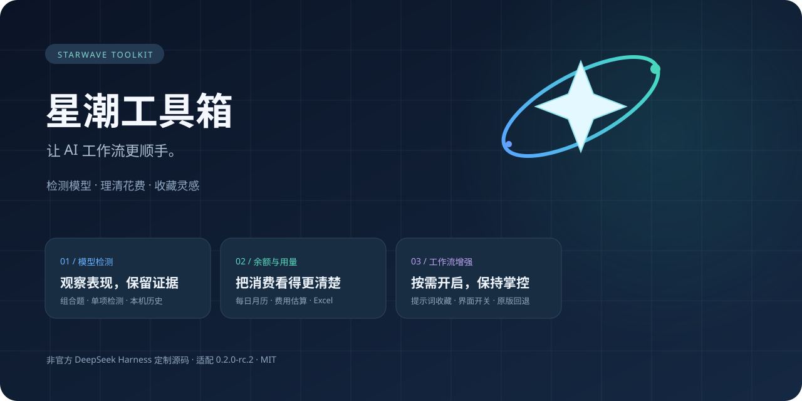

**星潮工具箱（Starwave Toolkit）** 是为 DeepSeek Harness 打造的工作流增强工具箱，将模型检测、多密钥管理、余额查询、消费统计和常用提示词集中到一起。你可以查看模型的检测表现，按密钥管理模型与用量，用月历和 Excel 梳理花费，也可以按需开启界面增强。

**适配版本：** DeepSeek Harness `0.2.0-rc.2` · **工具箱版本：** `1.1.0` · 社区维护

> 这是「源码 + 版本绑定兼容层」，不是在任意桌面版里上传 ZIP 即可安装的通用插件。兼容层包含修改后的上游打包代码；请先备份 Harness 安装与数据，不要对其他版本强行应用。

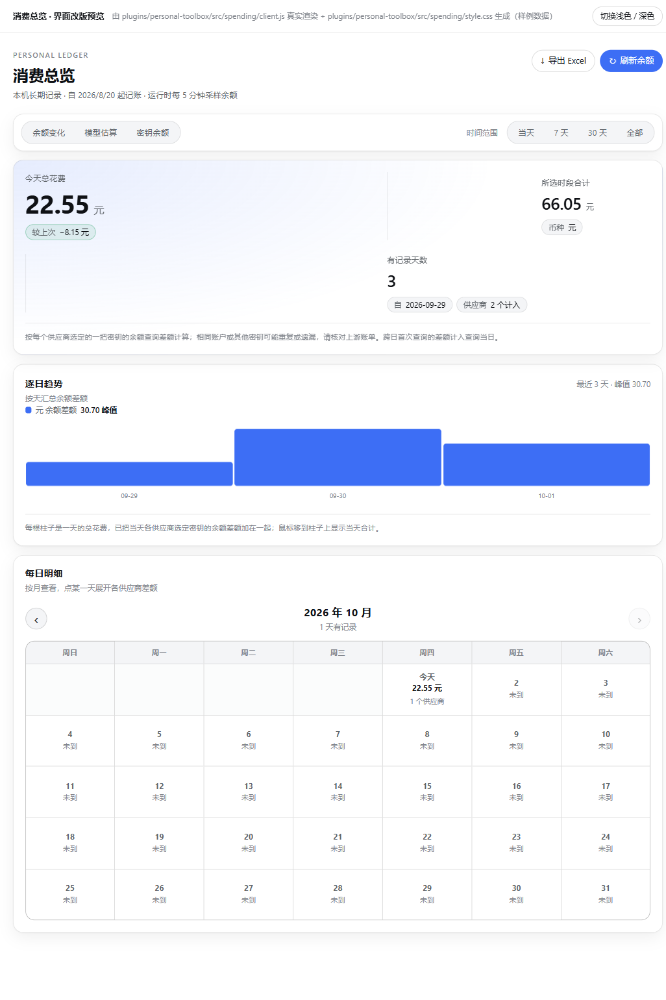

## 功能

- **智力检测**：独立后台请求，鹈鹕 SVG / 糖果推理、组合或单项检测、进度、原始答复与本机历史。
- **余额与消费**：按供应商和命名密钥查询余额，保留查询配置及长期消费记录。
- **消费总览**：每日月历、余额差额、token 用量、自定义单价估算、分类 Excel（.xlsx）导出，带标题冻结、筛选和隔行底色。
- **常用提示词**：在输入框填入本机收藏，不自动发送。
- **配套兼容层**：多密钥模型分组和路由、中文思考滑条、会话/技能菜单、连接状态以及 Windows 文件关联修复。

插件管理界面保留四个独立组件和一组界面兼容开关。关闭组件不会删除已有用户数据；关闭界面兼容开关不会撤销后台路由补丁。

## 界面一览

下面按实际功能顺序展示工具箱的主要界面。每个功能都可以独立使用，不需要改变 Harness 的主工作流。

### 工具箱详情与开关

详情页把四个功能组件和五项兼容增强分开列出。组件可以单独开启或关闭，兼容增强也有总开关和子开关；关闭入口不会删除已经保存的数据。

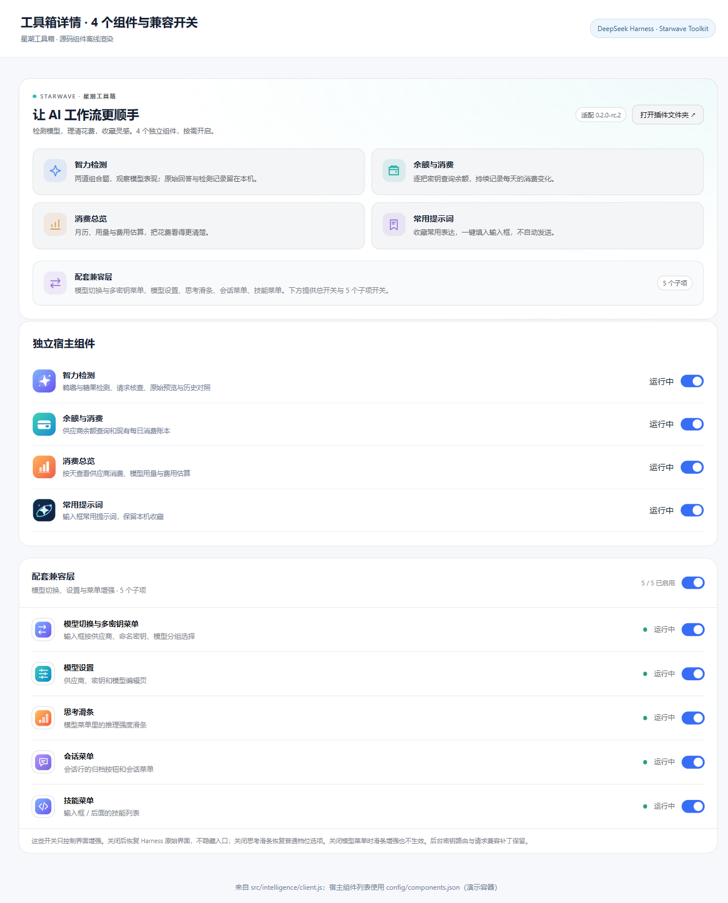

### 智力检测：详细模式

详细模式适合查看检测证据：每个模型卡片显示通过率、正常/半降智/降智次数、时间线、最近预览、糖果推理结论，以及请求核查、编辑、重测和删除入口。

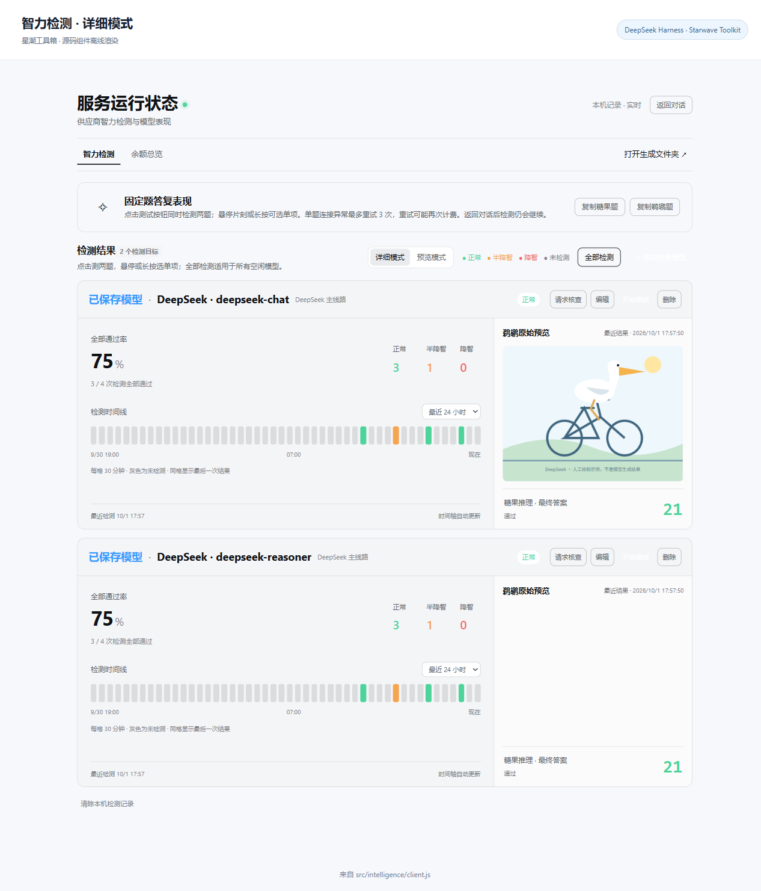

### 智力检测：预览模式

预览模式收起统计信息，只保留模型状态、开始测试、鹈鹕原始预览和糖果答案，适合快速比较多个模型。

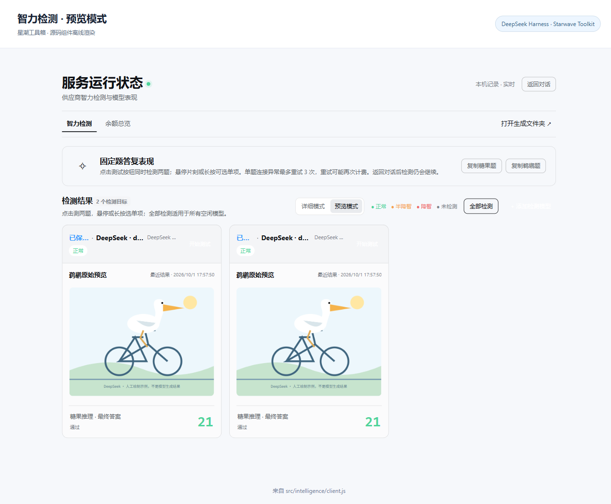

### 请求核查与历史证据

请求核查把请求情况、响应状态、耗时、重试、保存位置和重复内容检查集中展示；技术详情默认折叠，排查问题时再展开。

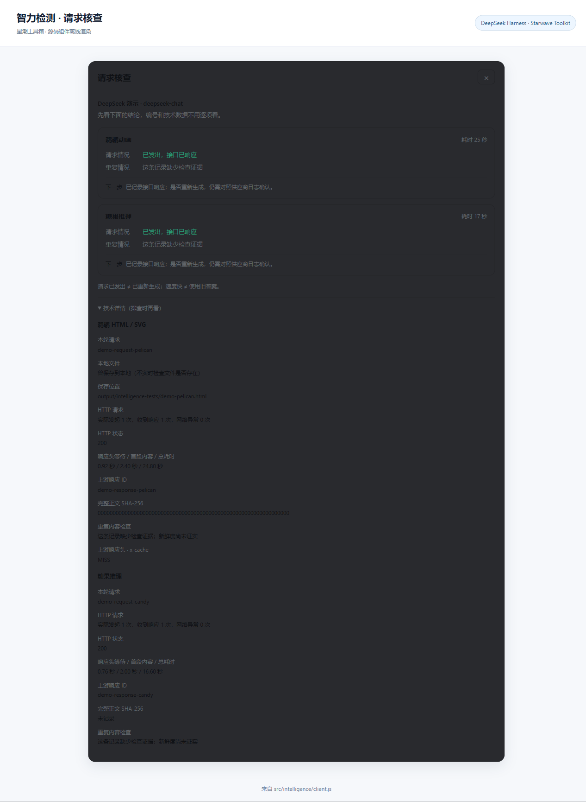

### 模型选择与命名密钥

模型选择器按 **DeepSeek → 命名密钥 → 模型** 分组，支持搜索。模型设置页把每个密钥绑定的模型单独列出，便于区分同一模型的不同密钥线路。

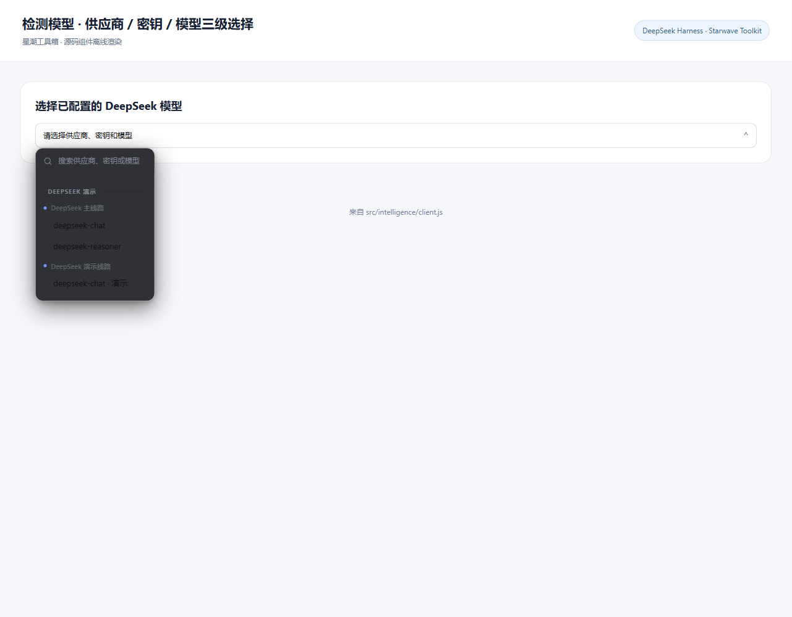

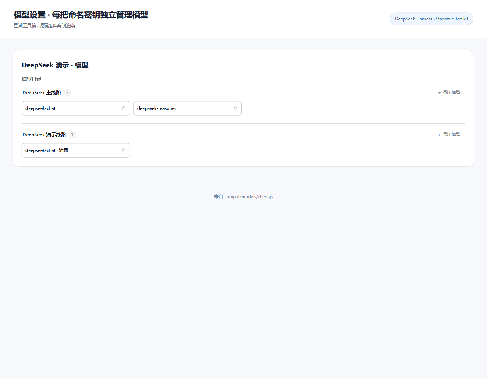

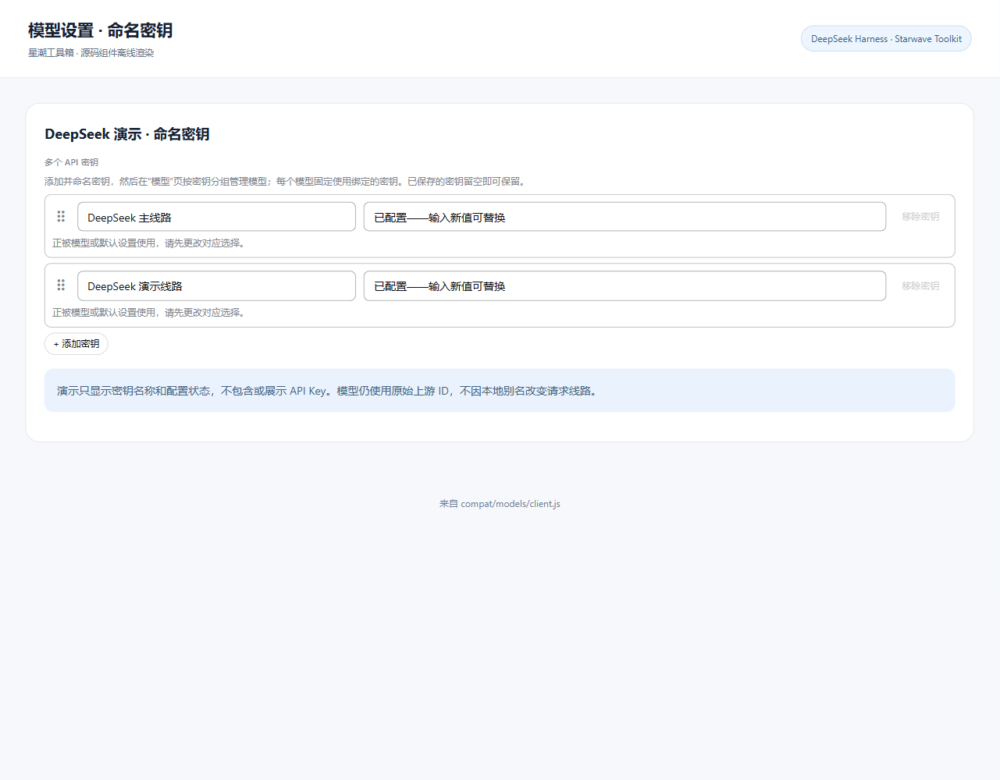

### 余额查询与每日消费

余额查询可以按密钥选择查询类型、地址、认证方式、刷新间隔和金额范围；成功查询后按供应商和密钥记录每日变化，并保留最近 7 天图表。

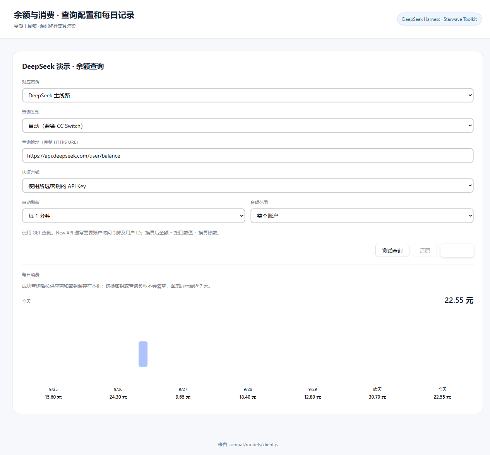

### 消费总览、模型估算与 Excel

消费总览提供余额变化、模型 token 用量、单价配置、月历明细和趋势图。Excel 导出包含每日汇总、余额明细、模型用量、余额读数、单价与统计设置等分类工作表。


### 常用提示词

常用提示词从输入框旁打开：可以新增、编辑、删除和选择收藏内容；选择后只填入输入框，不会自动发送。

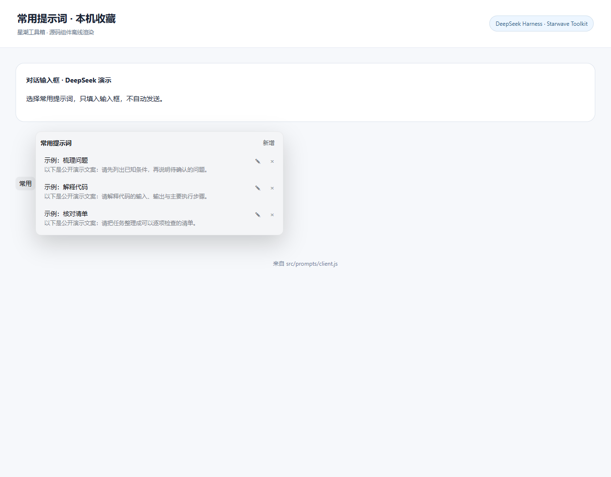

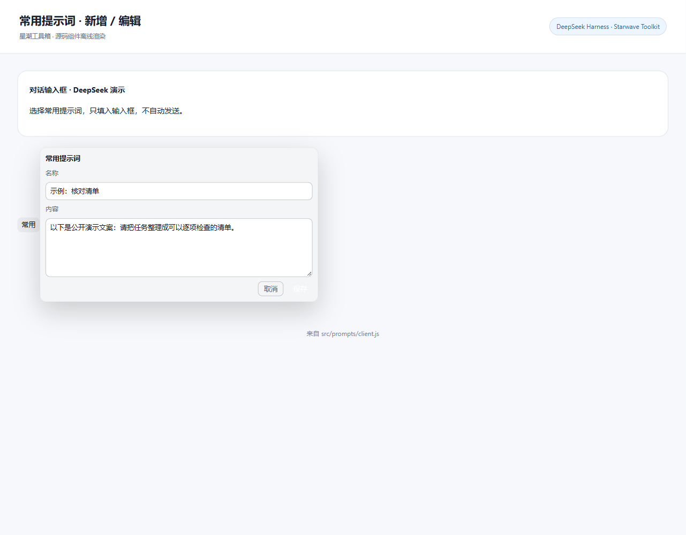

## 源码布局

```text
plugins/personal-toolbox/
├─ src/       intelligence、balance、spending、prompts、shared、bundle
├─ compat/    models、model-selection、routing、providers、connection、sessions、skills、windows
├─ config/    组件清单、版本及补丁映射
├─ assets/    图标
├─ locale/    中英文说明
├─ tools/     检查、构建、应用、备份、预览、首次注册、导出
├─ tests/     离线回归及可选浏览器测试生成器
└─ docs/      目录、维护规则、上游来源与迁移映射
```

代码位于 [plugins/personal-toolbox](plugins/personal-toolbox/README.md)。完整说明见 [目录说明](plugins/personal-toolbox/docs/DIRECTORY.md)、[维护规则](plugins/personal-toolbox/docs/MAINTENANCE.md) 和 [AI 接手说明](plugins/personal-toolbox/docs/AI-HANDOFF.md)。历史说明可能描述旧界面；当前源码及最新规则优先。

## 安装到兼容的 Harness

要求：Node.js 支持 `node:sqlite`（建议 Node 22.13+），已安装 `@deepseek-ai/dsh@0.2.0-rc.2`；Windows 是主要维护平台，资源管理器相关功能仅支持 Windows。这里不包含上游依赖或现成运行包。

1. **先备份**你的 Harness 安装、原 DSH_HOME 和浏览器数据。备份不是仅复制这个源码仓库。
2. 下载或克隆本仓库，把 `plugins/personal-toolbox/` 放到 **Harness 安装根目录**的同名位置；不要覆盖已有定制而不做备份。不要把整个仓库当 npm 依赖安装到 profile。
3. 在 Harness 安装根目录运行：

   ```powershell
   node plugins/personal-toolbox/tools/apply.mjs --check
   node plugins/personal-toolbox/tools/apply.mjs
   ```

   检查会拒绝不匹配的包版本或缺失的补丁目标。应用会替换清单指定的 11 个安装文件，并生成 bundle 与 4 个组件运行包。
4. **只有第一次安装**，在 web profile 已初始化且你确认允许添加组件后运行：

   ```powershell
   node plugins/personal-toolbox/tools/register-personal-plugin.mjs
   ```

   它会修改 profile 的依赖与 bundle 注册并保存原文件备份。现有安装更新不要重跑，以免改变组件状态。自定义数据目录须用原 `DSH_HOME`，或明确传入 `--home`。
5. 由你自行重启原 Harness 服务，并刷新原地址加载；本仓库脚本不替你启动新服务。

源码必须保持 `<Harness 根目录>/plugins/personal-toolbox/` 的布局，因为工具会据此定位项目、依赖和输出。不要在任意独立克隆目录运行 apply/register/heal/backup；尤其不要对真实 profile 运行不匹配版本的安装操作。

## 更新与开发

在兼容安装的插件目录中：

```powershell
npm run check
npm run apply
npm test
npm run export:source
```

不必每次修改都导出 ZIP。`export:source` 只导出源码及 SHA-256 清单；测试使用隔离/模拟数据，不需要真实密钥。浏览器测试生成器不是默认测试，也不会自动操作页面。

更新 Harness 前需重新适配兼容层；不能只修改版本号绕过检查。上游依赖重装会覆盖兼容替换，需要再次应用。不要用 npm install 命令代替首次注册或插件应用。

## 数据、费用与限制

- **仓库不含** API 密钥、用户配置、浏览器存储、检测历史、消费库或模型生成文件。
- 实际模型检测可能产生费用，部分临时失败会自动重试；重试不是免费续写。
- 公开版本不包含私人供应商缓存域名白名单；该机制仅保留不可解析的示例域名和离线测试，默认不改写真实端点的 URL。不承诺检测可以绕过上游缓存。
- 余额差额与 token 估算均不能替代上游完整账单；停用、强制退出或没有用量时可能缺失。
- 当前 UI 把元/CNY/USD/$/¥ 折叠到人民币显示口径，**不代表进行了真实汇率换算**。原始账本与查询配置保持原样，请据原始币种核对实际账单。
- 模型 HTML/SVG 在隔离 iframe 中预览，可能执行模型返回的脚本；不要把生成内容当可信本地程序执行。
- 桌面、上游供应商及浏览器行为需使用者自行验证。不承诺所有平台或版本兼容。

## 开源许可

[MIT License](LICENSE)。修改后的上游代码保留 DeepSeek 版权；详见 [第三方说明](THIRD-PARTY-NOTICES.md)。此项目与 DeepSeek 官方无隶属或背书关系。
